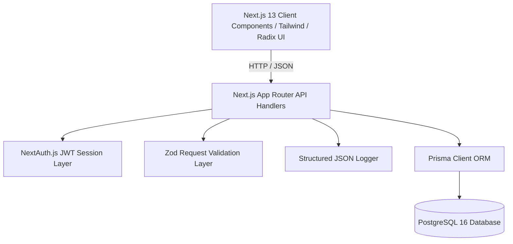

# 🏫 Enterprise School Management System

[](https://github.com/guljarhussain0560/School-Management/actions)
[](https://www.typescriptlang.org/)
[](https://nextjs.org/)
[](https://www.prisma.io/)
[](https://tailwindcss.com/)
[](https://vitest.dev/)
[](https://opensource.org/licenses/MIT)

A robust, enterprise-grade multi-tenant School Management System engineered with **Next.js (App Router)**, **TypeScript**, **Prisma ORM**, and **PostgreSQL**. Designed to handle end-to-end academic, financial, operational, and administrative workflows in modern educational institutions.

---

## 🌟 Key Functional Modules

- **🎓 Academic Management**: Curriculum design, class & section scheduling, batch assignments, timetable generation, and grading sheets.
- **📋 Admissions & Student Information**: Student onboarding wizard, document verification, biometric/roll assignment, and lifecycle records.
- **📊 Attendance Tracking**: Daily batch & subject-wise student attendance with Excel import/export and instant bulk present/absent triggers.
- **💳 Financial Operations & Fee Management**: Customizable fee structures, student invoice generation, fee receipt PDF downloads (`jsPDF`), expense tracking, and payroll processing.
- **🚌 Transport & Operations**: Fleet tracking, bus route management, driver/conductor assignments, safety alerts, and vehicle maintenance logs.
- **👥 Human Resources & Employee Management**: Teacher & staff directories, salary slip generation, leave management, and role-based permissions.
- **🔒 Role-Based Access Control**: NextAuth credentials authentication with distinct privileges for `ADMIN`, `TEACHER`, `STUDENT`, `PARENT`, and `TRANSPORT`.

---

## 🏗️ Architecture & Technology Stack



| Layer | Technology |
| :--- | :--- |
| **Frontend Framework** | [Next.js 13.5 (App Router)](https://nextjs.org/) + [React 18](https://react.dev/) |
| **Language** | [TypeScript 5.2](https://www.typescriptlang.org/) (Strict Mode) |
| **Styling & UI Components**| [Tailwind CSS](https://tailwindcss.com/), [Radix UI Primitives](https://www.radix-ui.com/), [Lucide React](https://lucide.dev/), [Sonner](https://sonner.emilkowal.ski/) |
| **State & Forms** | [React Hook Form](https://react-hook-form.com/), [Zod](https://zod.dev/) validation resolvers |
| **Database & ORM** | [PostgreSQL](https://www.postgresql.org/) with [Prisma ORM 6](https://www.prisma.io/) |
| **Authentication** | [NextAuth.js v4](https://next-auth.js.org/) with JWT session strategy |
| **Document Generation** | [jsPDF](https://github.com/parallax/jsPDF) (PDF receipts & salary slips), [XLSX](https://sheetjs.com/) (Excel batch imports) |
| **Testing Suite** | [Vitest](https://vitest.dev/), [@testing-library/react](https://testing-library.com/), [jsdom](https://github.com/jsdom/jsdom) |
| **CI/CD & DevOps** | [GitHub Actions](https://github.com/features/actions), [Docker](https://www.docker.com/), [Docker Compose](https://docs.docker.com/compose/) |

---

## 📁 Repository Structure

```
School-Management/
├── .devcontainer/              # VS Code remote development container config
├── .github/
│   ├── workflows/ci.yml       # Automated CI pipeline (lint, typecheck, test, audit, build)
│   ├── dependabot.yml         # Automated dependency vulnerability updates
│   └── PULL_REQUEST_TEMPLATE.md
├── app/
│   ├── (auth)/                # NextAuth login and registration routes
│   ├── api/                   # REST API route handlers
│   │   ├── academic/          # Classes, subjects, exams, attendance endpoints
│   │   ├── auth/              # Auth & user registration endpoints
│   │   ├── employee/          # Staff and teacher endpoints
│   │   ├── financial/         # Fee collection, payroll, invoices endpoints
│   │   ├── health/            # Production health check & DB monitor
│   │   └── operations/        # Buses, routes, safety alerts endpoints
│   ├── layout.tsx             # Root layout with theme and session providers
│   └── page.tsx               # Main application portal
├── components/
│   ├── academic/              # Academic, Attendance, Curriculum, and Exam subcomponents
│   ├── admin/                 # Refactored top-level Admin Dashboards
│   ├── financial/             # Fee collection, payroll form, expense sections & hooks
│   ├── operations/            # Transport, maintenance, safety components
│   ├── student/               # Student management components
│   └── ui/                    # Reusable Radix UI design system components
├── lib/
│   ├── api-handler.ts         # Standardized API error wrapper & responses
│   ├── auth.ts                # NextAuth options & credential provider
│   ├── logger.ts              # Structured JSON logging utility
│   ├── prisma.ts              # Global Prisma client singleton
│   ├── id-service.ts          # Institutional ID generation service
│   └── validation/            # Zod schemas for all domain entities
├── prisma/
│   ├── schema.prisma          # Relational PostgreSQL data schema
│   └── seed.ts                # Database seeder with mock schools and users
├── Dockerfile                 # Multi-stage optimized production build
├── docker-compose.yml         # Containerized PostgreSQL & App orchestration
├── vitest.config.ts           # Vitest test runner configuration
└── package.json
```

---

## 🚀 Quickstart & Installation

### Prerequisites
- **Node.js**: v18.17.0 or higher (v20+ recommended)
- **npm**: v9.0.0 or higher
- **PostgreSQL**: v14+ (or Docker)

### 1. Clone the Repository
```bash
git clone https://github.com/guljarhussain0560/School-Management.git
cd School-Management
```

### 2. Configure Environment Variables
Copy `.env.example` to `.env` and configure your database and authentication secrets:
```bash
cp .env.example .env
```

### 3. Install Dependencies
```bash
npm install
```

### 4. Setup Database & Seed Initial Data
```bash
# Generate Prisma Client types
npm run db:generate

# Run schema migrations
npm run db:push

# (Optional) Seed the database with demo accounts and data
npm run db:seed
```

### 5. Start Development Server
```bash
npm run dev
```
Open [http://localhost:3000](http://localhost:3000) in your browser.

---

## 🐳 Docker Setup

Run the entire application along with PostgreSQL using Docker Compose:

```bash
# Start PostgreSQL and Next.js App
docker compose up --build -d

# Check running services
docker compose ps

# Stop containers
docker compose down
```

The application will be accessible at [http://localhost:3000](http://localhost:3000).

---

## 🧪 Automated Testing

The project includes an automated test suite configured with **Vitest** and **React Testing Library**:

```bash
# Run all unit, component, and API route tests
npm test

# Run tests in interactive watch mode
npm run test:watch

# Generate code coverage report
npm run test:coverage

# Full validation check (Lint + Typecheck + Tests)
npm run validate
```

---

## 📜 Available NPM Scripts

| Command | Description |
| :--- | :--- |
| `npm run dev` | Starts local Next.js development server on port 3000 |
| `npm run build` | Builds optimized production bundle |
| `npm start` | Starts production server |
| `npm run lint` | Runs ESLint analysis across the repository |
| `npm run typecheck` | Validates TypeScript types (`tsc --noEmit`) |
| `npm test` | Executes Vitest test suite |
| `npm run test:coverage`| Generates test coverage report |
| `npm run validate` | Runs linting, typecheck, and test suite in sequence |
| `npm run db:generate` | Generates Prisma Client from schema |
| `npm run db:push` | Pushes Prisma schema directly to database |
| `npm run db:migrate` | Runs database migrations in dev |
| `npm run db:seed` | Populates database with sample administrative data |

---

## 🛡️ Security & Quality Standards

- **Input Validation**: All API routes strictly validate incoming JSON payloads with [Zod](https://zod.dev/) schemas.
- **Secret Hygiene**: Zero hardcoded credentials; all secrets and tokens are loaded strictly via environment variables.
- **Audit in CI**: Automated dependency vulnerability scanning via `npm audit --production` and weekly Dependabot PRs.
- **Structured Logging**: Comprehensive JSON logging with trace context, log levels, and standard error handling wrappers.

---

## 📄 License

This project is licensed under the MIT License - see the [LICENSE](LICENSE) file for details.
